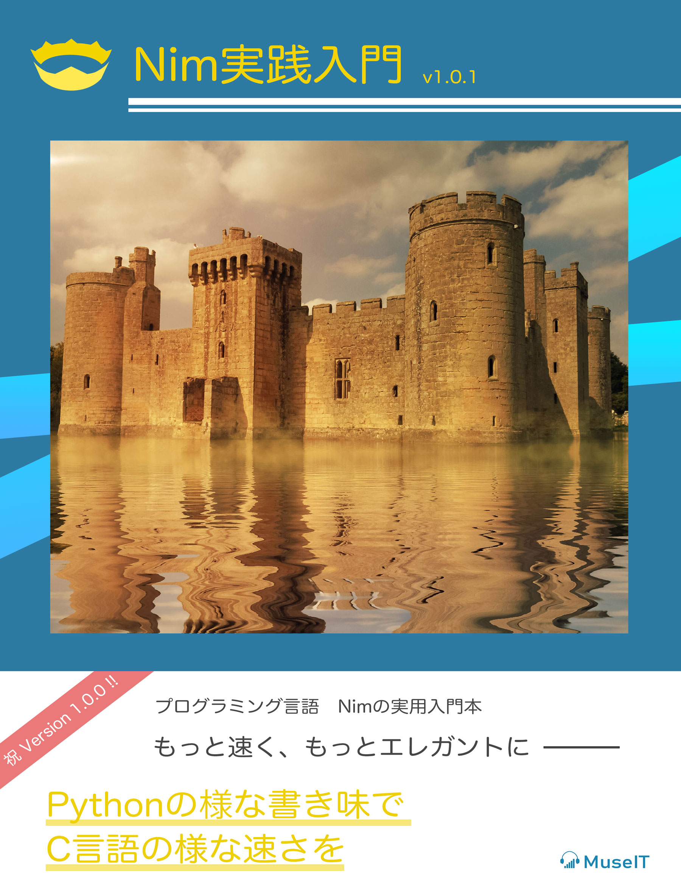

---?image="img/logo.svg"

# Nim

---

### Nimってどんな言語？

---

### Nimってどんな言語？
@ul[list-spaced-bullets text-09]
- 静的型付け言語
- Webから低レイヤ、組み込みまで
- C言語, C++, Javascript, Objective-Cにトランスパイル
- Pythonのような記述
@ulend

---

### Nimってどんな言語？
@ul[list-spaced-bullets text-09]
- メタプログラミングに強い
- AST（言語構文を）カスタマイズ可
- 実行速度が多数の言語よりも速い（c言語のoptimizeにだけ負ける）
@ulend

---

</img>
<a href="http://h-miyako.hatenablog.com/entry/2015/01/23/060000">参考はこちら</a>

---

### 始めるには

MacOSなら以下が楽

```
$ brew install nim
```

Windows：　公式HPからインストーラあり

Linux, Unix(MacOS)：以下でインストール

```
$ curl https://nim-lang.org/choosenim/init.sh -sSf | sh
```

---

### これで最新の安定板リリースが適用されます

```
$ choosenim update stable
```
---

### Nimble

- ライブラリパッケージマネージャー
- ライブラリを検索
```
$ nimble search <keyword>
$ nimble install <package-name>
```

---

### 実際の記述を見てみよう

---

#### 変数宣言

```nim
# 代入可能な変数
var token = "aa;owienkaksoiefp0a"

# 代入不可の変数
# このように複数を同時に宣言できます
let
  key: string = "apple"
  status: int = 3

# 定数
const level = 3
```

---

#### 関数宣言 その1


```nim
# procが関数定義になります。
proc add(x: int): int =
  return x + 1

# デフォルトでresultがreturn値として存在
proc add(x: int): int =
  result = x + 1

# 最後の式が評価されてreturnされます
proc add(x: int): int =
  x + 1
```

---

#### 関数数宣言 その２


```nim
func check(token: string): int =
    return 3

method check(token: string): int =
    discard
```

---

### if文、for文、try文

---

```nim
# if文
var test = 3
if test == 3:
    echo "success"
else:
    echo "failure"

# for文
for x in items:
  echo x

for i, x in items:
  # iにはloopカウントが入る
  discard

# try文
try:
  db.query()
else DBError:
  echo error.message
finally:
  discard
```

---

### サーバーのコードを見てみよう

```nim
import jester

settings:
  port = Port(5000)

routes:
  get "/user"
    let data = %*{"name", "test"}
    resp Http200, data

```

記述量が少なく書ける！

---

### nullの取り扱い


---

### テストコードが書きやすい!

```nim
type
  ObjRef = ref object
    n: int

doAssert ObjRef(n:1) != ObjRef(n:1)     # 参照が違うので一致しない
doAssert ObjRef(n:1)[] == ObjRef(n:1)[] # 値型なら一致する
```

unittestモジュールもある

---

### Nimbleプロジェクト

```
# Nimbleプロジェクトの作成
$ nimble init <プロジェクト名>

# 実行可能ファイルを生成する
$ nimble build

# ./nimbleのパスに設定されるためコマンドとして呼び出し可能になる
$ nimble install
```

---

### .nimble プロジェクト設定ファイル

```nim
# 依存パッケージはこのように書きます。
requires "nimx"

requires 
```
---

### ビルドオプション

- --threads: on
- -d: ssl
- --gc: none

---

###  GC設定

GCなしも設定できたり、種類も選べます。

```
$ nimble build --gc: none
```

---

### 最後に

---

### 宣伝

---

</img>

---


