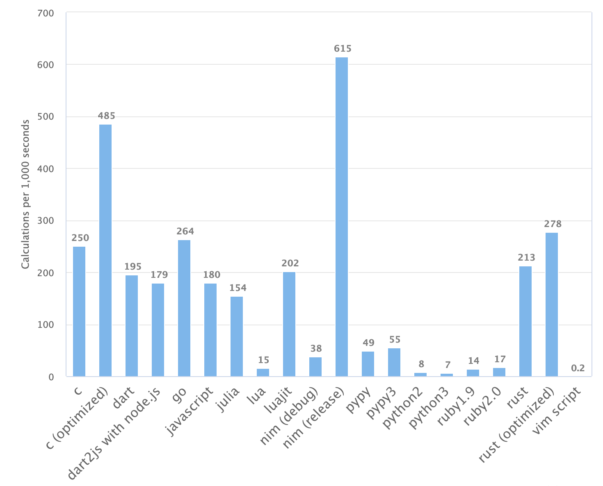

---?image="img/logo.svg"

# Nim

---

### Nimってどんな言語？

---

### Nimってどんな言語？ その１
@ul[list-spaced-bullets text-09]
- 静的型付け言語
- 組み込みからWebまで
- C言語, C++, Javascript, Objective-Cにトランスパイル
- Pythonのような記述
@ulend

---

### Nimってどんな言語？ その２
@ul[list-spaced-bullets text-09]
- メタプログラミングに強い
- AST（言語構文を）カスタマイズ可
- 実行速度がどの言語よりも速い
@ulend

---

速度比較の参考


---

### 始めるには

Windows：　公式HPからインストーラあり

Linux, Unix(MacOS)：以下でパッケージマネージャーをインストール


```
curl https://nim-lang.org/choosenim/init.sh -sSf | sh
```

---

### これで最新の安定板リリースが適用されます

```
choosenim update stable
```
---

### Nimble

- ライブラリパッケージマネージャー
- ライブラリを検索
```
nimble search <keyword>

```
- 

---

### 実際の記述を見てみよう

---

#### 変数宣言

```
# 代入可能な変数
var token = "aa;owienkaksoiefp0a"

# 代入不可の変数
# このように複数を同時に宣言できます
let
    key: string = "a;osiia;nksdf"
    status: int = 3

# 定数
const level = 3
```

---

#### 関数宣言 その1


```
# procが関数定義になります。
proc add(x: int): int =
  return x + 1

# デフォルトでresultがreturn値として存在
proc add(x: int): int =
  result = x + 1

# 最後の式が評価されてreturnされます
proc add(x: int): int =
  x + 1
```

---

#### 関数数宣言 その２


```
func check(token: string): int =
    return 3

method check(token: string): int =
    discard
```

---

### if文、for文、try文

```
# if文
var test = 3
if test == 3:
    echo "success"
else:
    echo "failure"

# for文
for x in items:
    echo x

# try文
try:
    db.query()
else DBError:
    echo error.message
finally:
    discard

---

### Nimbleプロジェクト

```
# Nimbleプロジェクトの作成
$ nimble init <プロジェクト名>

# 実行可能ファイルを生成する
$ nimble build

# ./nimbleのパスに設定されるためコマンドとして呼び出し可能になる
$ nimble install
```

---

### .nimble プロジェクト設定ファイル

```~/.nimble
requires "nimx"
```
---

### ビルドオプション

- --threads: on
- -d: ssl
- --gc: none

---

###  GC設定

```
$ nimble build --gc: none
```
